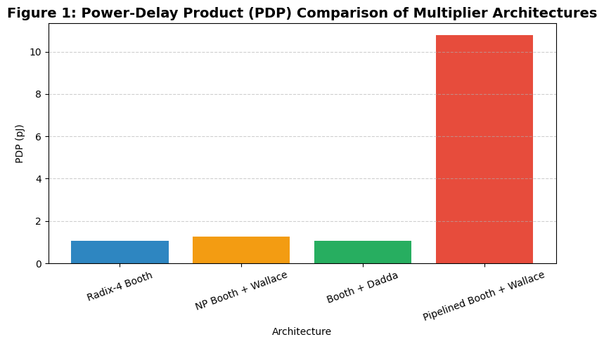
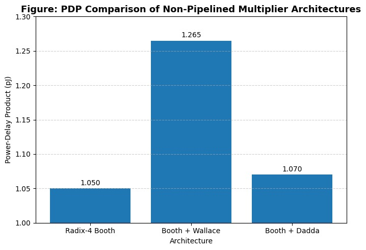

# Silicon Sprint Hackathon 2026
## Power-Aware 16-bit Multiplier Architectures

- **Team:** Silicon Sprint – Team 31
- **Event:** Silicon Sprint Hackathon
- **Organized by:** Mindgrove Technologies
- **In collaboration with:** SRM Institute of Science and Technology
- **Date:** March 10–11, 2026

---
## 🎯 Overview

- This project implements and evaluates multiple 16-bit multiplier architectures optimized for **low Power-Delay Product (PDP)**.
- The objective is to design a high-performance integer multiplier suitable for **energy-efficient DSP and accelerator systems**.

---
## 🎯 Problem Statement

- Design a **16×16 signed integer multiplier** optimized for the **lowest possible Power-Delay Product (PDP)**.
- Deliverables include:

1. Synthesizable RTL implementation
2. Verification across the full 16-bit input range
3. Synthesis reports including:

- * Area
- * Power consumption
- * Timing performance

The multiplier architectures are evaluated to determine the most efficient design for **energy-constrained digital systems**.

---
### ⚙️ Technology & Tools

| Category        | Tool                        |
| --------------- | --------------------------- |
| RTL Design      | SystemVerilog               |
| Simulation      | Cadence Xcelium             |
| Synthesis       | Cadence Genus               |
| Technology Node | 90 nm Standard Cell Library |

---
# 🧠 Multiplier Architectures Implemented

We implemented and analyzed the following architectures:

### 1️⃣ Radix-4 Booth Multiplier

Reduces the number of partial products by grouping multiplier bits in pairs.

Key idea:

```
16 partial products → 8 partial products
```

Benefits:

* Lower switching activity
* Reduced hardware complexity
* Good PDP efficiency

---

### 2️⃣ Wallace Tree Multiplier

Uses **parallel carry-save compression** to reduce partial products quickly.

Architecture:

```
Partial Products
        ↓
Wallace Tree Reduction
        ↓
Final Carry Propagate Adder
```

Benefits:

* Very fast multiplication
* Reduced critical path delay

Trade-off:

* Higher switching activity
* Increased dynamic power

---

### 3️⃣ Radix-4 Booth + Wallace Tree

Combines:

* **Booth encoding → fewer partial products**
* **Wallace compression → faster reduction**

Architecture:

```
Inputs
  ↓
Radix-4 Booth Encoder
  ↓
Partial Product Generator
  ↓
Wallace Tree Reduction
  ↓
Final Adder
  ↓
Product
```

---

### 4️⃣ Radix-4 Booth + Dadda Tree

Uses **Dadda reduction**, which minimizes the number of compressors required.

Reduction sequence:

```
8 → 6 → 4 → 3 → 2
```

Advantages:

* Lower number of adders
* Reduced power consumption
* Slightly better PDP compared to Wallace

---

### 5️⃣ Pipelined Radix-4 Booth + Wallace Multiplier

We implemented a **3-stage pipelined architecture** to improve throughput.

Pipeline stages:

```
Stage 1
Booth Encoding + Partial Product Generation

Stage 2
Wallace Reduction (Stage1 + Stage2)

Stage 3
Final Wallace Reduction + CLA Adder
```

Benefits:

* Higher clock frequency
* Increased throughput

Trade-off:

* Increased power due to pipeline registers
* Higher PDP compared to non-pipelined designs

---

## 📊 Evaluation Metrics

The following metrics were used to evaluate each architecture:

| Metric | Description             |
| ------ | ----------------------- |
| Power  | Total power consumption |
| Delay  | Critical path delay     |
| Area   | Synthesized cell area   |
| PDP    | Power × Delay           |

**PDP definition:**

```bash
PDP = Power * times Delay
```
---
## 📈 Key Observations

### Radix-4 Booth

* Low switching activity
* Good power efficiency
* Competitive PDP

---

### Radix-4 Booth + Wallace

* Faster reduction
* Higher power consumption due to many compressors

---

### Radix-4 Booth + Dadda

* Similar delay to Wallace
* Slightly lower power
* **Lowest PDP among non-pipelined designs**

---

### Pipelined Radix-4 Booth + Wallace

* Critical path divided into **3 stages**
* Higher achievable clock frequency
* Increased power consumption due to pipeline registers
* PDP increases compared to non-pipelined designs

However, it provides **significantly higher throughput**.

---
## Performance Evaluation

| Architecture                | Area (µm²) | Delay (ps)     | Power (mW) | PDP (pJ) |
| --------------------------- | ---------- | -------------- | ---------- | ---      |
| Radix-4 Booth               |  5280.891  |    3862        |   0.274    |  1.05    |
| NP Booth + Wallace          |  6150.569  |    3346        |   0.379    |  1.265   |
| Booth + Dadda               |  5104.534  |    3959        |   0.2705   |  1.07    |
| Pipelined Booth + Wallace   | 11403.455  |  3000 (T_clk)  |   3.6      |  10.8    |

**Screenshot: Comparision Table**


---
### Power Comparision Chart

**Overall PDP Comparision bar plot**




**PDP Comparision of Non Pipelined Architecture**



---
## 🏆 Final Design Conclusion

- The primary objective of this project was to design a **16-bit multiplier architecture with the lowest possible Power-Delay Product (PDP)**.

- Multiple multiplier architectures were implemented and evaluated, including Radix-4 Booth, Wallace Tree, Dadda Tree, and pipelined versions of these designs. Each architecture was synthesized and analyzed to compare power consumption, critical path delay, and overall PDP.

### Non-Pipelined Architectures

- Among the non-pipelined designs, both **Radix-4 Booth + Wallace Tree** and **Radix-4 Booth + Dadda Tree** produced very similar delay characteristics. However, the **Dadda Tree reduction requires fewer compressor units compared to Wallace Tree**, which reduces switching activity and dynamic power.

- As a result, the **Radix-4 Booth + Dadda Tree multiplier achieved the lowest PDP among all non-pipelined architectures**, making it the most power-efficient solution.

---

### Pipelined Architectures

- To explore higher-performance implementations, a **pipelined Radix-4 Booth + Wallace Tree multiplier** was developed.

- The pipeline divides the critical path into **three stages**:

1. Booth Encoding + Partial Product Generation
2. Wallace Tree Reduction
3. Final Wallace Reduction + Carry Lookahead Adder

- By splitting the critical path, the **clock period is determined by the slowest pipeline stage rather than the entire multiplier path**, allowing the design to operate at a significantly **higher clock frequency**.

- However, introducing pipeline registers increases switching activity and clock power. Due to this overhead, the pipelined implementation resulted in a **Power-Delay Product approximately 10× higher than the non-pipelined architecture**.

- Despite this increase in PDP, the pipelined design provides **much higher throughput**, making it suitable for high-performance systems.

- Among the pipelined designs explored, the **Radix-4 Booth + Wallace Tree pipeline achieved the best PDP within the pipelined category**.

---

# 📊 Final Architectural Insights

| Architecture                      | Key Advantage                            |
| --------------------------------- | ---------------------------------------- |
| Radix-4 Booth + Dadda Tree        | Lowest PDP (Best power-efficient design) |
| Radix-4 Booth + Wallace Tree      | Similar delay but slightly higher power  |
| Pipelined Radix-4 Booth + Wallace | Highest throughput                       |
| Pipelined Radix-4 Booth + Wallace | Best PDP among pipelined designs         |


- Considering the goal of **minimizing Power-Delay Product**, the **Radix-4 Booth + Dadda Tree multiplier is selected as the final optimized architecture**.

- The **pipelined Radix-4 Booth + Wallace multiplier** is recommended for applications requiring **high throughput and higher clock frequency**, although it comes with increased PDP due to pipeline overhead.

---
# 👨‍💻 Authors

This project was developed as part of the **Silicon Sprint Hackathon 2026**.

**Divya Darshan V R**
- Roll No: 2023105032
- B.E. Electronics and Communication Engineering (3rd Year)
- College of Engineering, Guindy
- Anna University, Chennai-25.

**Goutham Badhrinath V**
- Roll No: 2023105036 
- B.E. Electronics and Communication Engineering (3rd Year)
- College of Engineering, Guindy
-Anna University, Chennai-25.

---

# 🙏 Acknowledgements

We would like to thank **Mindgrove Technologies** and **SRM Institute of Science and Technology** for organizing the **Silicon Sprint Hackathon 2026**, which provided an excellent platform to explore **power-aware digital hardware design** and multiplier architecture optimization.

---
